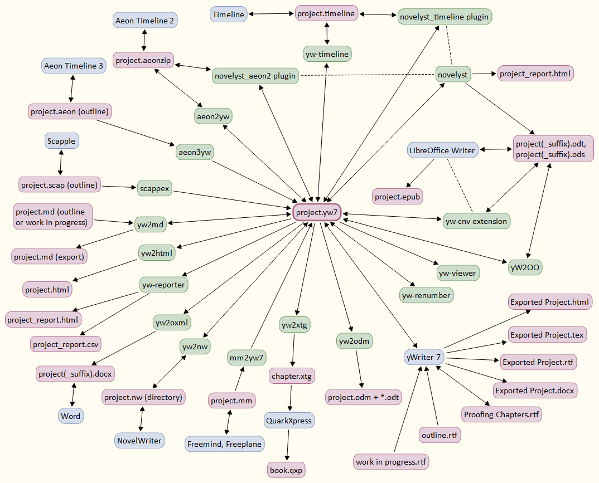

# PyWriter: Read, write, and process yWriter 7 files with Python

[yWriter 7](http://www.spacejock.com/yWriter7.html) is a free word processor whose strengths are structuring novels and controlling the progress during the writing process. The PyWriter library provides Python classes to read and write yWriter 7 projects and convert the project data to and from several file formats such as odt, ods, csv, and html.

## Requirements

- [Python](https://www.python.org) version 3.6+.

## Applications

Based on the  _pywriter_  library, there now are several applications, supporting the novelist's work with yWriter in combination with a powerful Office suite. 

For more information, see my [GitHub home page](https://peter88213.github.io).

The diagram below shows a part of the "ecosystem" created around the *.yw7* file format. Nodes in green represent Python scripts or applications based on the *PyWriter* library.

## Development

*PyWriter* is organized as an Eclipse PyDev project. The official release branch on GitHub is *main*.

### Conventions

See https://github.com/peter88213/PyWriter/blob/main/docs/conventions.md

## Development tools

- [Python](https://python.org) version 3.10.
- [Eclipse IDE](https://eclipse.org) with [PyDev](https://pydev.org) and *EGit*.
- Apache Ant is used for building applications

### Documentation tools

- [Eclipse Papyrus](https://www.eclipse.org/papyrus/) Modeling environment for creating Use Case and Class diagrams
- [PlantUML](https://plantuml.com) for creating Sequence diagrams

## License

PyWriter is distributed under the [MIT License](http://www.opensource.org/licenses/mit-license.php).
