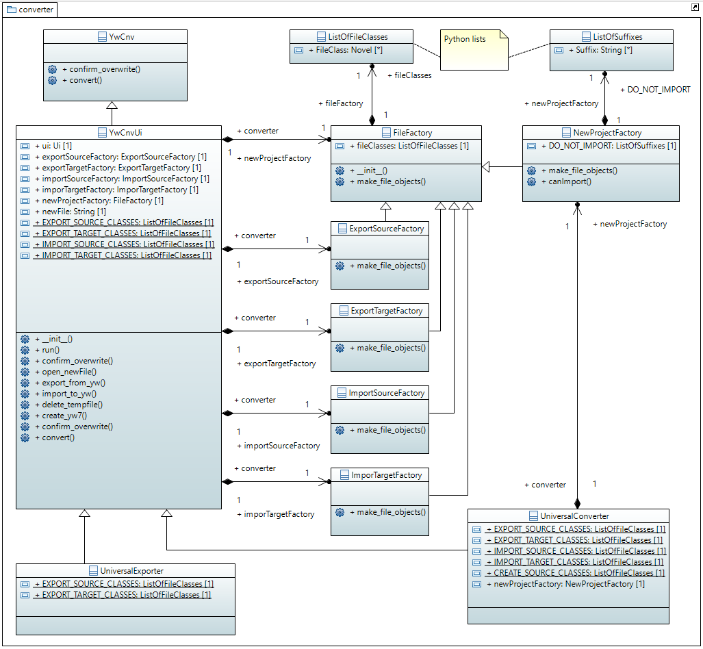

[home](index) > [pywriter](pywriter) > converter

---

# The converter package - Convert from one file format to another

This package contains modules for converting a novel project from a source file to 
a target file. Typically, one of the two is a yWriter project file. 

## Modules

- **yw_cnv** -- Provide the base class for Novel file conversion.

- **yw_cnv_ui** -- Provide a class for Novel file conversion with user interface.

- **universal_converter** -- Provide a converter class for universal import and export.

- **universal_exporter** -- Provide a converter class for universal export from a yWriter project.

---

- **file_factory** -- Provide a base class for factories that instantiate conversion objects.

- **export_source_factory** -- Provide a factory class for any export source object.

- **export_target_factory** -- Provide a factory class for any export target object.

- **import_source_factory** -- Provide a factory class for any import source object.

- **import_target_factory** -- Provide a factory class for any import target object.

- **new_project_factory** -- Provide a factory class for source and target objects to create a new yWriter project.

## Classes

