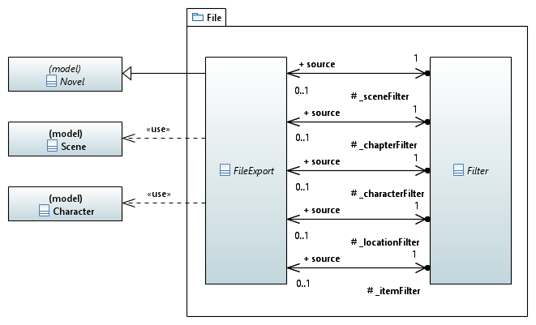

[home](../../index) > [pywriter](pywriter) > file

---

# The file package - Shared modules for template-based document generation

This is how the file generation from a yWriter project is generally done:
The write method runs through all chapters, scenes, and world building 
elements, such as characters, locations ans items, and fills templates. 

The package's [README](https://github.com/peter88213/PyWriter/tree/master/src/pywriter/file#readme) file contains a list of templates and placeholders.

## Modules
 
- **file_export** -- Provide a generic class for template-based file export.
- **filter** -- Provide a generic filter class for template-based file export.
- **sc_lc_filter** -- Provide a scene per location filter class for template-based file export.
- **sc_cr_filter** -- Provide a scene per character filter class for template-based file export.
- **sc_tg_filter** -- Provide a scene per tag filter class for template-based file export.
- **sc_it_filter** -- Provide a scene per item filter class for template-based file export.
- **sc_vp_filter** -- Provide a scene per viewpoint filter class for template-based file export.

## Classes

