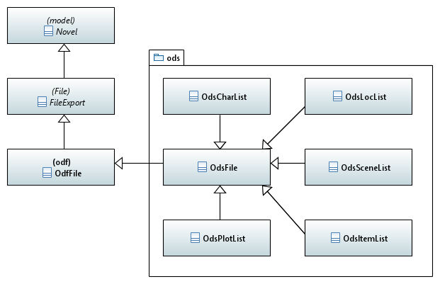

[home](../../index) > [pywriter](pywriter) > ods

---

# The ods package - Modules for writing Open Document spreadsheet documents
 
## Modules
 
- **ods_file** -- Provide a generic class for ODS file export.

- **ods_charlist** -- Provide a class for ODS character list export. 

- **ods_itemlist** -- Provide a class for ODS item list export.

- **ods_loclist** -- Provide a class for ODS location list export.

- **ods_plotlist** -- Provide a class for ODS plot list export.

- **ods_scenelist** -- Provide a class for ODS scene list export.

## Classes

