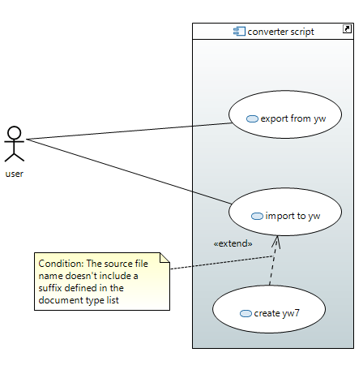

[Home](../../index) > [Specifications](index) > Use cases

---

# Use cases

The system is a Python converter script using the classes of the pywriter library. 
The user's input is passed as command line arguments to the script. 

## uc1 Export from yw

The user wants a document with content from an existing yWriter project. The target document types with their indicating suffixes are listed [here](types). 

The user launches the converter script, giving two arguments: The file path to the yWriter project, and the suffix of the target document.

The converter script reads the yWriter project, and creates a new target document in the same directory as the yWriter project is located. The file name of the target document equals the file name of the yWriter project (except the file extension) plus the suffix given as argument.

## uc2 Import to yw

The user wants to transfer the content of an existing source document to an existing yWriter project. The source document is located in the same directory as the yWriter project. The file name of the source document equals the file name of the yWriter project (except the file extension) plus a suffix specified [here](types). 

The user launches the converter script, giving one argument: The file path to the source document.

The converter script reads the source document, identifies the project content, and replaces the corresponding content of the existing yWriter project.

## uc3 Create yw7

The user wants to transfer the content of an existing source document to a new yWriter 7 project. 

The user launches the converter script, giving one argument: The file path to the source document. The source document's file name doesn't include a suffix of the "import" document types listed [here](types).

The converter script reads the source document, identifies the project content, and creates a new yWriter 7 project at the same location as the source document. The file name of the yWriter project equals the file name of the source document (except the file extension). 

