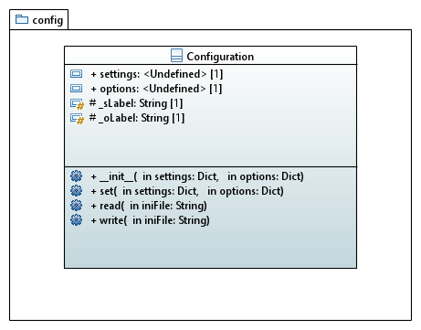

[home](../index) > [The pywriter library](index) > configuration

---

# The config package - Use persistent configurations

This package contains modules for configuration persistence.

## Modules

- **configuration** -- Provide a Configuration class for reading and writing INI files.

## Classes

### Overview

### Detailed class diagram

