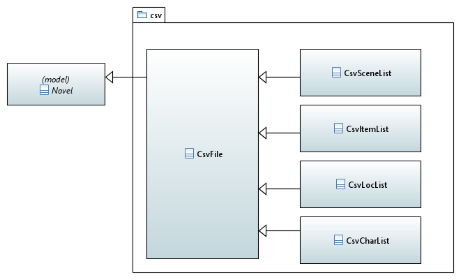
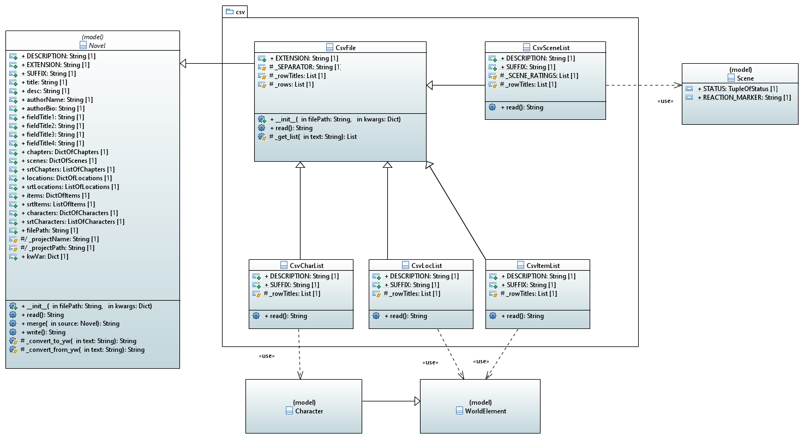

[home](../index) > [The pywriter library](pywriter) > csv

---

# The csv package - Modules for reading csv spreadsheet documents

The csv format is mainly used to read spreadsheet documents exported by Office 
applications like OpenOffice and LibreOffice. This is because the csv format 
is much easier to parse than the ods format.

## Modules
 
- **csv_file** -- Provide a generic class for csv file import.

- **csv_charlist** -- Provide a class for csv character list import. 

- **csv_itemlist** -- Provide a class for csv item list import.

- **csv_loclist** -- Provide a class for csv location list import.

- **csv_plotlist** -- Provide a class for csv plot list import.

- **csv_scenelist** -- Provide a class for csv scene list import.

## Classes

### Overview

### Detailed class diagram

