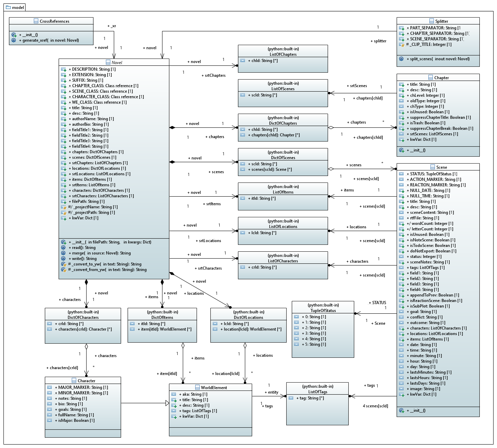

[home](../index) > [The pywriter library](index) > model

---

# The model package - Modules for representation of yWriter's meta model
 
## Modules
 
- **novel** -- Provide a generic class for yWriter project representation.
- **chapter** -- Provide a class for yWriter chapter representation.
- **scene** -- Provide a class for yWriter scene representation.
- **world_element** -- Provide a generic class for yWriter story world element representation.
- **character** -- Provide a class for yWriter character representation.
- **cross_references** -- Provide a class for yWriter cross reference generation.
- **splitter** -- Provide a helper class for scene and chapter splitting.

## Classes

### Overview

### Detailed class diagram

