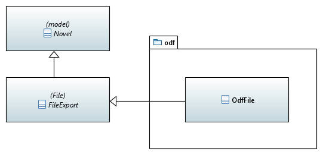
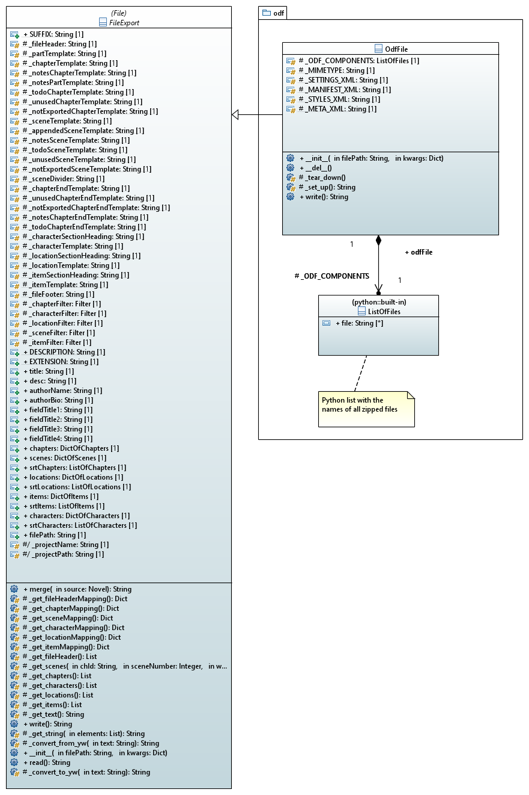

[home](../index) > [pywriter library overview](index) > odf

---

# The odf package - Shared modules for writing Open Document files
 
## Modules
 
- **odf_file** -- Provide a generic class for OpenDocument xml file export.

## Classes

### Overview

### Detailed class diagram

*Click on the diagram to enlarge*