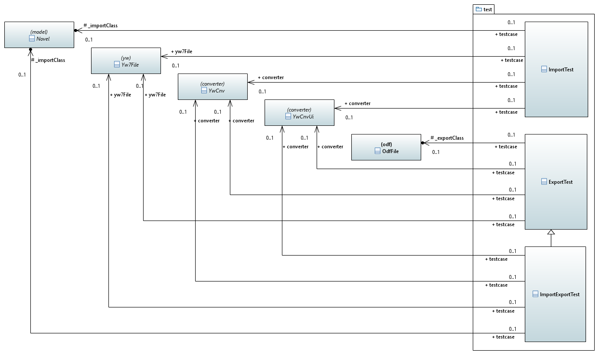
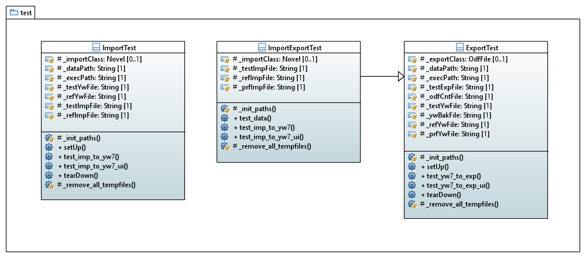

[home](../index) > [pywriter library overview](index) > test

---

# The test package - Modules for automated regression tests.

## Modules
 
- **helper** -- Helper module for reading utf-8 or ANSI encoded files.
- **export_test** -- Provide an abstract test case class for yWriter export.
- **import_export_test** -- Provide an abstract test case class for yWriter import and export.
- **import_test** -- Provide an abstract test case class for yWriter import.

## Classes

### Overview

*Click on the diagram to enlarge*

### Detailed class diagram

*Click on the diagram to enlarge*