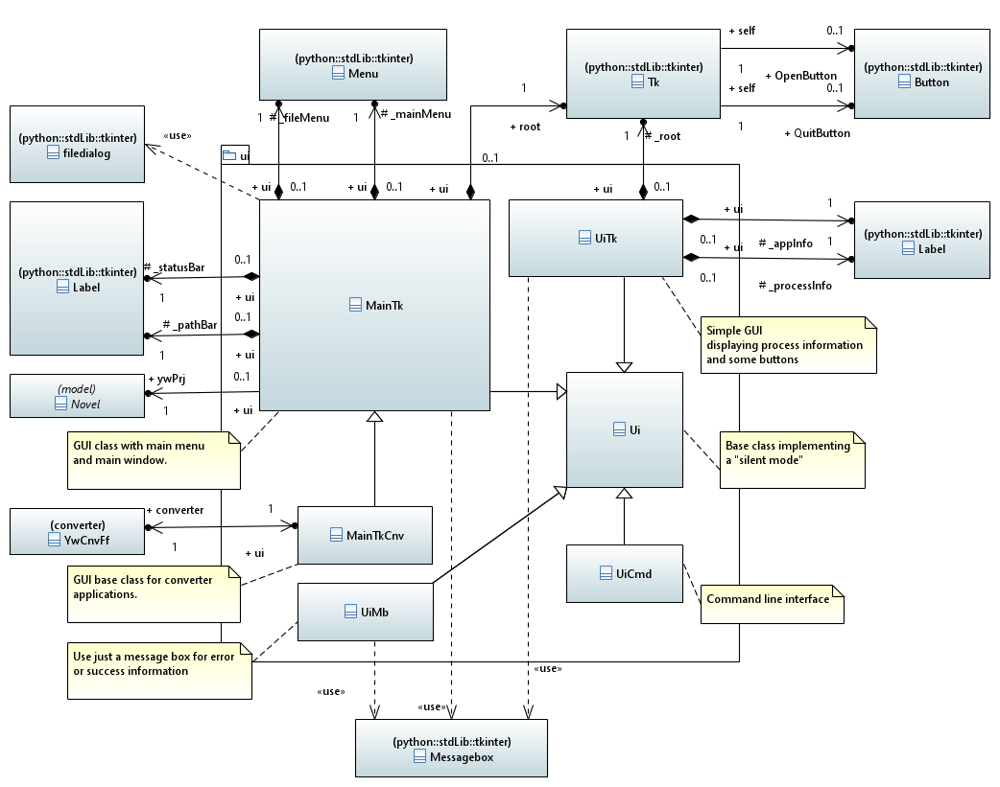
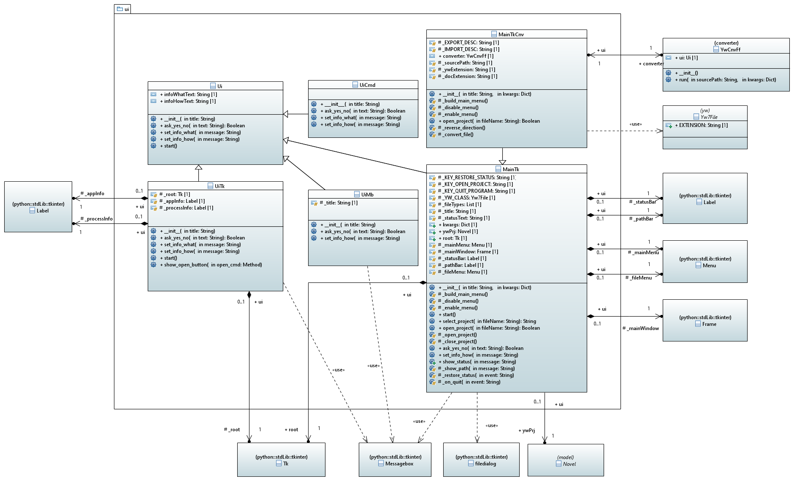

[home](../index) > [The pywriter library](index) > ui

---

# The ui package - Modules for user interfaces
 
## Modules
 
- **ui** -- Provide a base class for user interface facades.
- **ui_cmd** -- Provide a facade for a command line user interface.
- **ui_tk** -- Provide a facade for a Tkinter based GUI.
- **ui_mb** -- Provide a facade for a GUI featuring just message boxes.
- **main_tk** -- Provide a tkinter GUI class with main menu and main window.
- **main_tk_cnv** -- Provide a tkinter GUI base class for converter applications.

## Classes

### Overview

### Detailed class diagram

