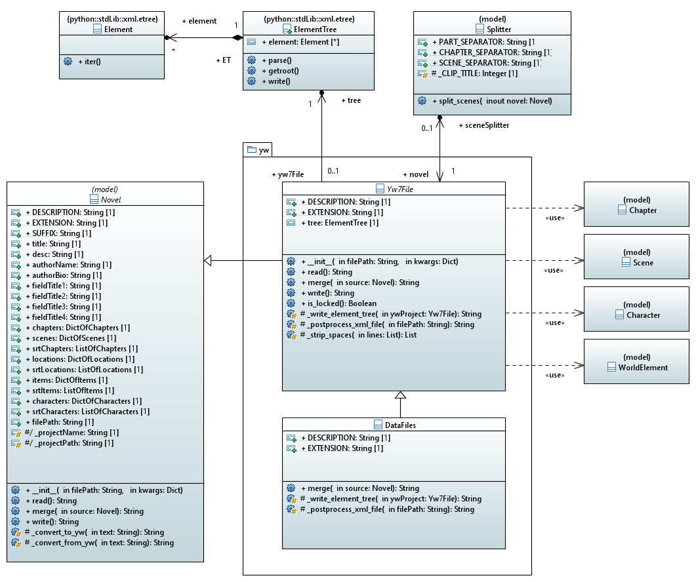

[home](../index) > [pywriter library overview](index) > yw

---

# The yw package - Modules for reading and writing yWriter project files
 
## Modules
 
- **yw7_file** -- Provide a class for yWriter 7 project import and export.
- **data_files** -- Provide a class for yWriter XML data files.
- **xml_indent** -- Provide an xml pretty printer.

## Classes

### Overview

### Detailed class diagram

[)(img/yw_package_detailed_class_diagram.png)

*Click on the diagram to enlarge*
