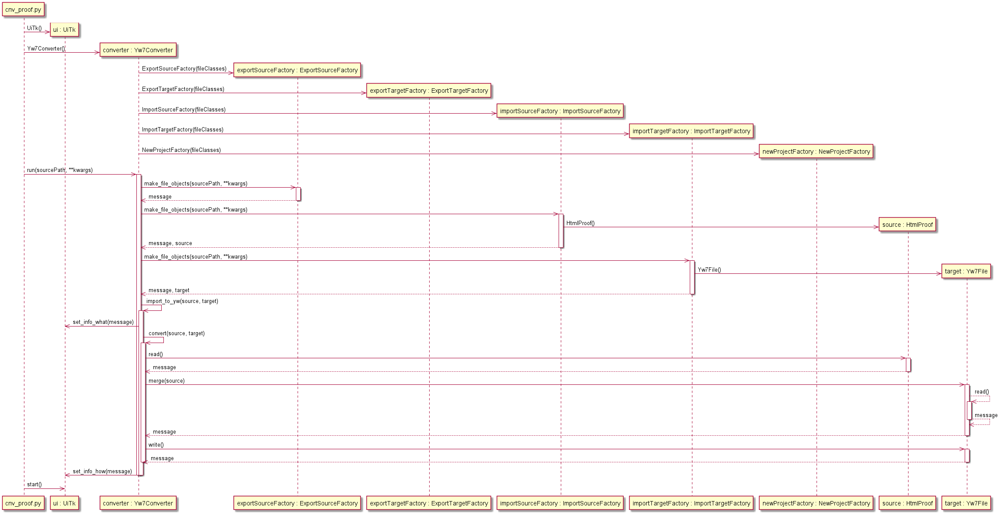
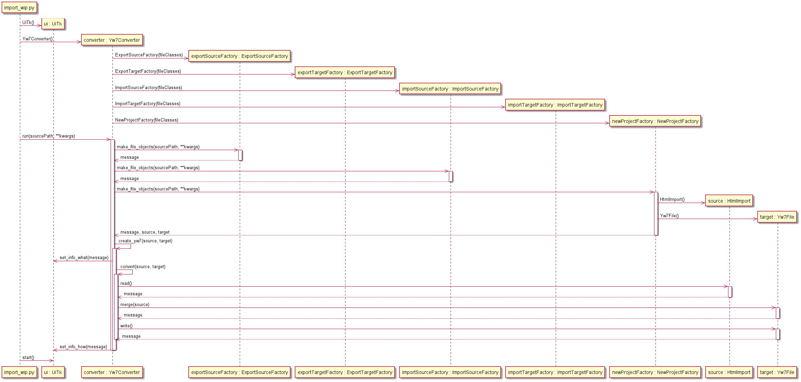

[Home](../../index) > [Specifications](index) > Example sequences

---

# Example sequences

The [src/samples](https://github.com/peter88213/PyWriter/tree/main/src/sample) directory contains some sample Python converter scripts using the classes of the pywriter library. 

The following are some example sequence diagrams, each illustrating one of the use cases. 

## Export from yw: Convert yWriter chapters and scenes to odt format.

*Click on the diagram to enlarge*

## Import to yw: Update an existing yWriter project from a "proofed" html file.

*Click on the diagram to enlarge*

## Create yw7: Create a new yWriter 7 project from a "work in progress" html file. 

*Click on the diagram to enlarge*
