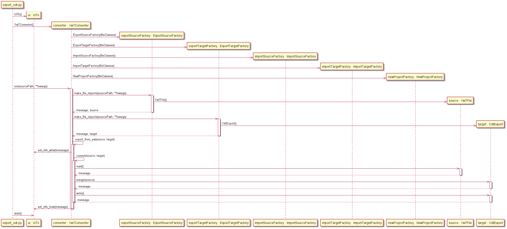

[Home](../../index) > [Specifications](index) > Example sequences

---

# Example sequences

The [src/samples](https://github.com/peter88213/PyWriter/tree/main/src/sample) directory contains some sample Python converter scripts using the classes of the pywriter library. 

The following are some example sequence diagrams, each illustrating one of the use cases. 

## Export from yw: Convert yWriter chapters and scenes to odt format.

